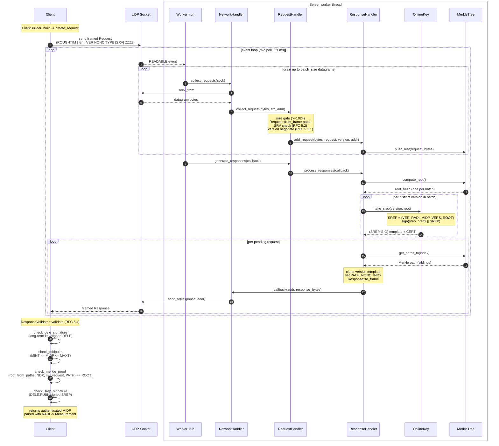

# Request/Response Flow

End-to-end flow of a single Roughtime exchange. Function names
reference the code; see `doc/RFC-PROTOCOL.md` for the wire format and
`doc/draft-ietf-ntp-roughtime-*.txt` for the spec.

## Overview

- The server runs N worker threads, each owning its own UDP socket via
  `SO_REUSEPORT`; we lean on the kernel to load-balance datagrams across them. 
  No shared state or allocations on the hot path.
- Each worker drains batches of requests, commits them all to a single Merkle
  tree, signs once per distinct protocol version, and emits one response per
  request (differing only in PATH, NONC, INDX across responses in a batch).
- The client reconstructs the Merkle root from its own request and walks the 
  signature chain back to the server's long-term key, which it knows
  out-of-band.

## Sequence Diagram



## Trust chain verified by the client

```
long-term key --signs--> DELE (online key + [MINT,MAXT])
    DELE.PUBK --signs--> SREP (ROOT, MIDP, RADI)
         ROOT --commits--> Merkle tree --contains--> client's request (nonce)
```

## Code references

| Stage | Location |
|-------|----------|
| Worker event loop | `crates/roughenough-server/src/worker.rs` (`Worker::run`) |
| Datagram read | `crates/roughenough-server/src/network.rs` (`collect_requests`) |
| Parse + validate + negotiate | `crates/roughenough-server/src/requests.rs` (`collect_request`) |
| Frame/TLV decode | `crates/roughenough-protocol/src/{wire,request,header}.rs` |
| Batch staging | `crates/roughenough-server/src/responses.rs` (`add_request`) |
| Build responses | `crates/roughenough-server/src/responses.rs` (`process_responses`) |
| Sign SREP | `crates/roughenough-keys/src/online/onlinekey.rs` (`make_srep`) |
| Merkle root / path | `crates/roughenough-merkle/src/lib.rs` (`compute_root`, `get_paths_to`) |
| Client validation | `crates/roughenough-client/src/validation.rs` (`ResponseValidator::validate`) |
| Root reconstruction | `crates/roughenough-merkle/src/lib.rs` (`root_from_paths`) |
